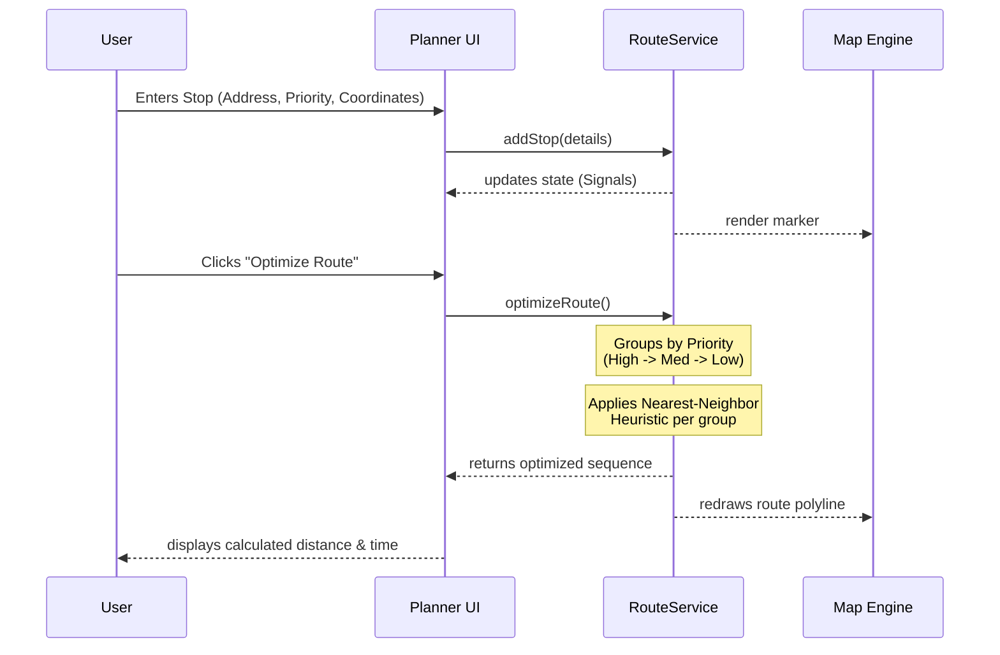
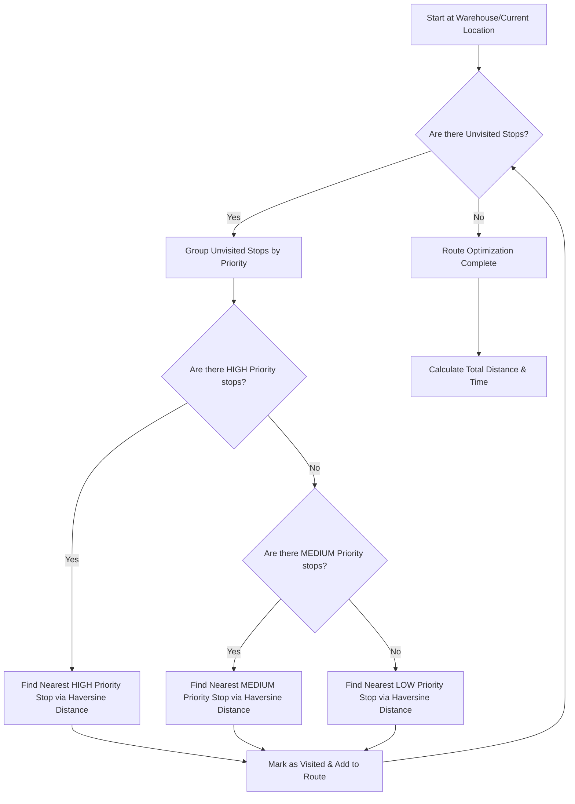

<div align="center">
  
# 📍 RouteWise

**Plan smarter. Deliver faster.**

RouteWise is a smart delivery route planner and optimizer designed for independent couriers, field workers, and logistics dispatchers. Turn scattered locations into an efficient, easy-to-follow route to save time and reduce unnecessary travel.

[](https://route-wise-two.vercel.app/)
[](https://angular.io/)
[](https://www.typescriptlang.org/)
[](https://vercel.com/)

</div>

---

## 🚀 Overview

RouteWise addresses the core challenge of modern delivery and field operations: **route optimization without the complexity**. 
Whether you're handling 5 stops or 50, RouteWise takes your list of destinations, factors in priority constraints, and calculates the most optimal path using a heuristic Nearest-Neighbor approach.

### ✨ Key Features
- **Intelligent Route Optimization:** Calculates the most efficient path honoring stop priorities.
- **Interactive Cartography:** Visualize your entire journey on a dynamic Leaflet map.
- **Priority Management:** Define High, Medium, and Low priorities—urgent stops are serviced first.
- **Drag & Drop Reordering:** Manually fine-tune your optimized route.
- **Real-Time Metrics:** Instantly view total distance (km) and estimated travel time.
- **Premium UX/UI:** A sleek, modern SaaS landing page with a responsive 3D-inspired interactive map hero.

---

## 🏗️ How It Works

### 1. User Workflow



### 2. Optimization Heuristic

The optimization engine uses a specialized **Priority-Aware Nearest-Neighbor algorithm**.



---

## 🛠️ Tech Stack

- **Framework:** Angular 18+ (Standalone Components, Signals, OnPush Change Detection)
- **Mapping:** Leaflet.js
- **Interactions:** Angular CDK (Drag & Drop)
- **Styling:** Vanilla CSS (Custom properties, 3D CSS transforms for Landing Page)
- **Deployment:** Vercel

---

## 💻 Getting Started

### Prerequisites
- Node.js (v18 or higher)
- npm or yarn

### Installation

1. **Clone the repository**
   ```bash
   git clone https://github.com/yourusername/RouteWise.git
   cd RouteWise
   ```

2. **Install dependencies**
   ```bash
   npm install
   ```

3. **Run the development server**
   ```bash
   npm run dev
   ```
   *The application will be available at `http://localhost:4200`.*

---

## 🛣️ Roadmap (Future Scope)

While currently tailored for independent operators, RouteWise is laying the groundwork for a robust enterprise solution:
- **Team Workspaces:** Dedicated environments for companies to manage multiple drivers.
- **Dispatcher Dashboard:** Assign routes to specific drivers remotely.
- **Backend Integration:** PostgreSQL databases for persistent assignments, auth (JWT), and historical analytics.
- **Real-Time Tracking:** Live location updates for drivers en-route.

---
*Built with ❤️ for modern logistics and field operations.*
